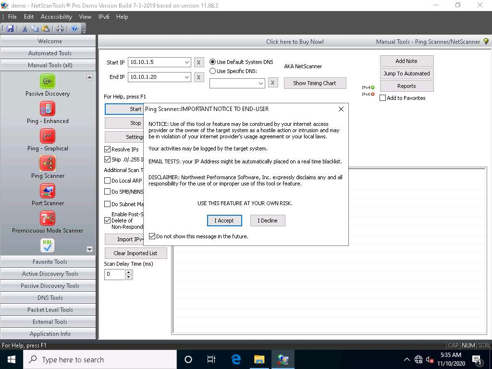
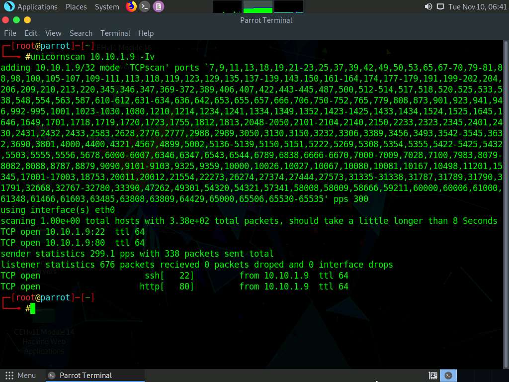
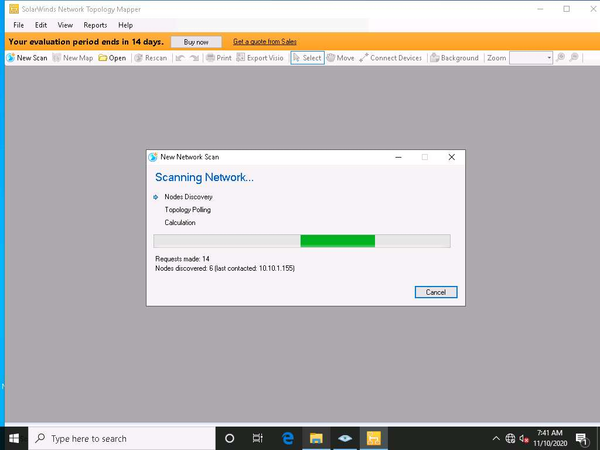
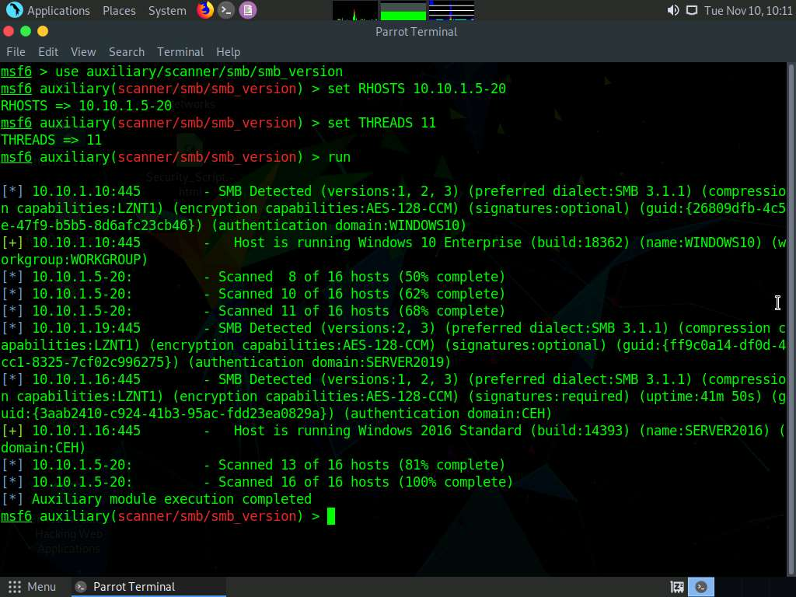
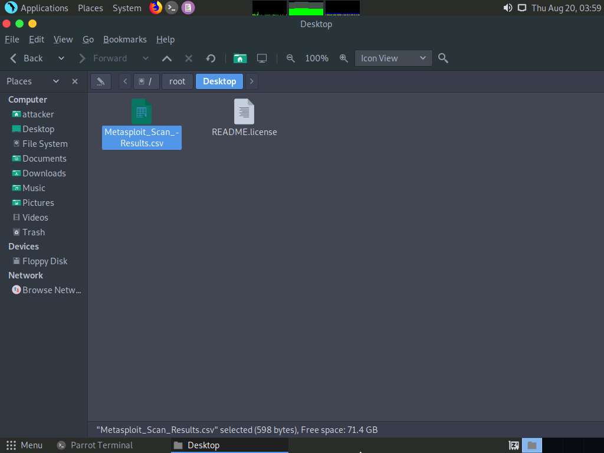

#  Module 03: Scanning Networks

## Scenario

Earlier, you gathered all possible information about the target such as organization information (employee details, partner details, web links, etc.), network information (domains, sub-domains, IP addresses, network topology, etc.), and system information (OS details, user accounts, passwords, etc.).

Now, as an ethical hacker, or as a penetration tester (hereafter, pen tester), your next step will be to perform port scanning and network scanning on the IP addresses that you obtained in the information-gathering phase. This will help you to identify an entry point into the target network.

Scanning itself is not the actual intrusion, but an extended form of reconnaissance in which the ethical hacker and pen tester learns more about the target, including information about open ports and services, OSes, and any configuration lapses. The information gleaned from this reconnaissance helps you to select strategies for the attack on the target system or network.

This is one of the most important phases of intelligence gathering, which enables you to create a profile of the target organization. In the process of scanning, you attempt to gather information, including the specific IP addresses of the target system that can be accessed over the network (live hosts), open ports, and respective services running on the open ports and vulnerabilities in the live hosts.

Port scanning will help you identify open ports and services running on specific ports, which involves connecting to Transmission Control Protocol (TCP) and User Datagram Protocol (UDP) system ports. Port scanning is also used to discover the vulnerabilities in the services running on a port.

The labs in this module will give you real-time experience in gathering information about the target organization using various network scanning and port scanning techniques.

## Objective

The objective of this lab is to conduct network scanning, port scanning, analyzing the network vulnerabilities, etc.

Network scans are needed to:
- Check live systems and open ports
- Identify services running in live systems
- Perform banner grabbing/OS fingerprinting
- Identify network vulnerabilities
- Draw network diagrams of vulnerable hosts

## Overview of Scanning Networks

Network scanning is the process of gathering additional detailed information about the target by using highly complex and aggressive reconnaissance techniques. The purpose of scanning is to discover exploitable communication channels, probe as many listeners as possible, and keep track of the responsive ones.

Types of scanning:
- **Port Scanning**: Lists open ports and services
- **Network Scanning**: Lists the active hosts and IP addresses
- **Vulnerability Scanning**: Shows the presence of known weaknesses

## Lab Tasks

Ethical hackers and pen testers use numerous tools and techniques to scan the target network. Recommended labs that will assist you in learning various network scanning techniques include:

1. Perform host discovery
    - Perform host discovery using Nmap
    - Perform host discovery using Angry IP Scanner
    
2.	Perform port and service discovery
    - Perform port and service discovery using MegaPing
    - Perform port and service discovery using NetScanTools Pro
    - Explore various network scanning techniques using Nmap
    - Explore various network scanning techniques using Hping3

3.	Perform OS discovery
    - Identify the target system’s OS with Time-to-Live (TTL) and TCP window sizes using Wireshark
    - Perform OS discovery using Nmap Script Engine (NSE)
    - Perform OS discovery using Unicornscan

4.	Scan beyond IDS and Firewall
    - Scan beyond IDS/firewall using various evasion techniques
    - Create custom packets using Colasoft Packet Builder to scan beyond IDS/firewall
    - Create custom UDP and TCP packets using Hping3 to scan beyond IDS/firewall
    - Create custom packets using Nmap to scan beyond IDS/firewall

5.	Draw network diagrams
    - Draw network diagrams using Network Topology Mapper

6.	Perform network scanning using various scanning tools
    - Scan a target network using Metasploit

---

# Lab 1: Perform Host Discovery

**Lab Scenario**  
  
As a professional ethical hacker or pen tester, you should be able to scan and detect the active network systems/devices in the target network. During the network scanning phase of security assessment, your first task is to scan the network systems/devices connected to the target network within a specified IP range and check for live systems in the target network.

**Lab Objectives**

- Perform host discovery using Nmap
- Perform host discovery using Angry IP Scanner

**Overview of Host Discovery**
  
Host discovery is considered the primary task in the network scanning process. It is used to discover the active/live hosts in a network. It provides an accurate status of the systems in the network, which, in turn, reduces the time spent on scanning every port on every system in a sea of IP addresses in order to identify whether the target host is up.

The following are examples of host discovery techniques:
- ARP ping scan
- UDP ping scan
    - ICMP ping scan (ICMP ECHO ping, ICMP timestamp, ping ICMP, and address mask ping)
    - TCP ping scan (TCP SYN ping and TCP ACK ping)
- IP protocol scan
  
## Task 1: Perform Host Discovery using Nmap

Nmap is a utility used for network discovery, network administration, and security auditing. It is also used to perform tasks such as network inventory, managing service upgrade schedules, and monitoring host or service uptime.

Here, we will use Nmap to discover a list of live hosts in the target network. We can use Nmap to scan the active hosts in the target network using various host discovery techniques such as ARP ping scan, UDP ping scan, ICMP ECHO ping scan, ICMP ECHO ping sweep, etc.

>Note: Here, we will consider EC-Council as a target organization.

1. Select **CEHv11 Windows 10** machine and click **Ctrl+Alt+Del**.

2. By default, **Admin** user profile is selected, type **Pa$$w0rd** in the Password field and press **Enter** to login.

    
   
3. Navigate to the Desktop and double-click **Nmap - Zenmap GUI** shortcut. 

    

4. The **Nmap - Zenmap** GUI appears; in the **Command** field, type the command **nmap -sn -PR [Target IP Address]** (here, the target IP address is **10.10.1.16**) and click **Scan**.

    >Note: **-sn**: disables port scan and **-PR**: performs ARP ping scan.

5. The scan results appear, indicating that the target **Host is up**, as shown in the screenshot.

    >Note: In this lab, we are targeting the **Windows Server 2016** (**10.10.1.16**) machine.

    >Note: The ARP ping scan probes ARP request to target host; an ARP response means that the host is active.

    

6. In the **Command** field, type **nmap -sn -PU [Target IP Address]**, (here, the target IP address is **10.10.1.16**) and click **Scan**. The scan results appear, indicating the target **Host is up**, as shown in the screenshot.

    >Note: **-PU**: performs the UDP ping scan.

    >Note: The UDP ping scan sends UDP packets to the target host; a UDP response means that the host is active. If the target host is offline or unreachable, various error messages such as “host/network unreachable” or “TTL exceeded” could be returned.

    

7. Now, we will perform the ICMP ECHO ping scan. In the **Command** field, type **nmap -sn -PE [Target IP Address]**, (here, the target IP address is **10.10.1.16**) and click **Scan**. The scan results appear, indicating that the target **Host is up**, as shown in the screenshot.

    >Note: **-PE**: performs the ICMP ECHO ping scan.

    >Note: The ICMP ECHO ping scan involves sending ICMP ECHO requests to a host. If the target host is alive, it will return an ICMP ECHO reply. This scan is useful for locating active devices or determining if the ICMP is passing through a firewall.

    

8. Now, we will perform an ICMP ECHO ping sweep to discover live hosts from a range of target IP addresses. In the **Command** field, type **nmap -sn -PE [Target Range of IP Addresses]** (here, the target range of IP addresses is **10.10.1.11-20**) and click **Scan**. The scan results appear, indicating the target **Host is up**, as shown in the screenshot.

    >Note: In this lab task, we are scanning **Windows Server 2019**, **Windows Server 2016**, **Parrot Security** and **Android** machines.

    >Note: The ICMP ECHO ping sweep is used to determine the live hosts from a range of IP addresses by sending ICMP ECHO requests to multiple hosts. If a host is alive, it will return an ICMP ECHO reply.

    

9. Apart from the aforementioned network scanning techniques, you can also use the following scanning techniques to perform a host discovery on a target network.
    - **ICMP Timestamp and Address Mask Ping Scan**: These techniques are alternatives for the traditional ICMP ECHO ping scan, which are used to determine whether the target host is live specifically when administrators block the ICMP ECHO pings.

        **Example** –

        ICMP timestamp ping scan

        **#  nmap -sn -PP [target IP address]**

        ICMP address mask ping scan

        **#  nmap -sn -PM [target IP address]**

    - **TCP SYN Ping Scan**: This technique sends empty TCP SYN packets to the target host, ACK response means that the host is active.

        **#  nmap -sn -PS [target IP address]**

    - **TCP ACK Ping Scan**: This technique sends empty TCP ACK packets to the target host; an RST response means that the host is active.

        **#  nmap -sn -PA [target IP address]**

    - **IP Protocol Ping Scan**: This technique sends different probe packets of different IP protocols to the target host, any response from any probe indicates that a host is active.

        **#  nmap -sn -PO [target IP address]**

10. This concludes the demonstration of discovering the target host(s) in the target network using various host discovery techniques.

11. Close all open windows and document all the acquired information.

---

## Task 2: Perform Host Discovery using Angry IP Scanner

Angry IP Scanner is an open-source and cross-platform network scanner designed to scan IP addresses as well as ports. It simply pings each IP address to check if it is alive; then, optionally by resolving its hostname, determines the MAC address, scans ports, etc. The amount of gathered data about each host can be extended with plugins. 

Here, we will use the Angry IP Scanner tool to discover the active hosts in the target network.

1. Click **CEHv11 Windows 10** to switch to the **Windows 10** machine, navigate to **D:\CEH-Tools\CEHv11 Module 03 Scanning Networks\Ping Sweep Tools\Angry IP Scanner** and double-click **ipscan-3.7.2-setup.exe**.

    >Note: If **User Account Control** pop-up appears, click **Yes**.

    

2. **Angry IP Scanner Setup** window appears, click **Next** to continue and install the tool using default settings.

    

3. After the completion of installation, check **Run Angry IP Scanner** checkbox and click **Finish**.

    

4. **Angry IP Scanner** starts, and a **Getting Started** window pops up. Click **Next**, follow the wizard, and click **Close**.

    >Note: **Open File - Security Warning** window appears, click **Run**.

    

5. The **IP Range - Angry IP Scanner** window appears, as shown in the screenshot.

6. In the **IP Range** fields, type the IP range as **10.10.1.0** to **10.10.1.255** and click the **Preferences** icon beside the **IP Range** menu, as shown in the screenshot.

    

7. The **Preferences** window appears. In the **Scanning** tab, under the **Pinging** section, select the **Pinging method** as **Combined UDP+TCP** from the drop-down list.

    

8. Now, switch to the **Display** tab. Under the **Display in the results list** section, select the **Alive hosts (responding to pings) only** radio button and click **OK**.

    

9. In the **IP Range - Angry IP Scanner** window, click the **Start** button to start scanning the IP range that you entered.

    

10. **Angry IP Scanner** starts scanning the IP range and begins to list out the alive hosts found. Check the progress bar on the bottom-right corner to see the progress of the scanning.

11. After the scanning is completed, a **Scan Statistics** pop-up appears. Note the total number of **Hosts alive** (here, 6) and click **Close**.

    

12. The results of the scan appear in the **IP Range - Angry IP Scanner** window. You can see all active IP addresses with their hostnames listed in the main window.

    

13. This concludes the demonstration of discovering alive hosts in the target range of IP addresses using various Angry IP Scanner.

14. You can also use other ping sweep tools such as **SolarWinds Engineer’s Toolset** (https://www.solarwinds.com), **NetScanTools Pro** (https://www.netscantools.com), **Colasoft Ping Tool** (https://www.colasoft.com), **Visual Ping Tester** (http://www.pingtester.net), and **OpUtils** (https://www.manageengine.com) to discover active hosts in the target network.

15. Close all open windows and document all the acquired information.

---

# Lab 2: Perform Port and Service Discovery

**Lab Scenario**  
  
As a professional ethical hacker or a pen tester, the next step after discovering active hosts in the target network is to scan for open ports and services running on the target IP addresses in the target network. This discovery of open ports and services can be performed by using various port scanning tools and techniques.

**Lab Objectives**

- Perform port and service discovery using MegaPing
- Perform port and service discovery using NetScanTools Pro
- Explore various network scanning techniques using Nmap
- Explore various network scanning techniques using Hping3

**Overview of Port and Service Discovery**
  
Port scanning techniques are categorized according to the type of protocol used for communication within the network.
- TCP Scanning
    - Open TCP scanning methods (TCP connect/full open scan)
    - Stealth TCP scanning methods (Half-open Scan, Inverse TCP Flag Scan, ACK flag probe scan, third party and spoofed TCP scanning methods)
- UDP Scanning
- SCTP Scanning
    - SCTP INIT Scanning
    - SCTP COOKIE/ECHO Scanning
- SSDP and List Scanning
- IPv6 Scanning

## Task 1: Perform Port and Service Discovery using MegaPing

MegaPing is a toolkit that provides essential utilities for Information System specialists, system administrators, IT solution providers, and individuals. It is used to detect live hosts and open ports of the system in the network, and can scan your entire network and provide information such as open shared resources, open ports, services/drivers active on the computer, key registry entries, users and groups, trusted domains, printers, etc. You can also perform various network troubleshooting activities with the help of integrated network utilities such as DNS lookup name, DNS list hosts, Finger, host monitor, IP scanner, NetBIOS scanner, ping, port scanner, share scanner, traceroute, and Whois.

Here, we will use the MegaPing tool to scan for open ports and services running on the target range of IP addresses.

1. In the **Windows 10** machine, navigate to **D:\CEH-Tools\CEHv11 Module 03 Scanning Networks\Scanning Tools\MegaPing** and double-click **megaping_setup.exe**.

    >Note: If a **User Account Control** pop-up appears, click **Yes**.

2. The **MegaPing - InstallShield Wizard** window appears; click **Next** and follow the wizard-driven installation steps to install **MegaPing**.

3. After the completion of the installation, click on the **Launch the program** checkbox and click **Finish**.

    

4. The **About MegaPing** window appears; click the **I Agree** button.

    

5. The **MegaPing (Unregistered)** GUI appears displaying the **System Info**, as shown in the screenshot.

    

6. Select the **IP Scanner** option from the left pane. In the **IP Scanner** tab in the right-hand pane, enter the IP range in the **From** and **To** fields; in this lab, the IP range is **10.10.1.5** to **10.10.1.20**; then, click **Start**.

    

7. MegaPing lists all IP addresses under the specified target range with their TTL value, Status (dead or alive), and statistics of the dead and alive hosts, as shown in the screenshot.

    

8. Select the **Port Scanner** option from the left-hand pane. In the **Port Scanner** tab in the right-hand pane, enter the IP address of the **Windows Server 2016** (**10.10.1.16**) machine into the **Destination Address List** field and click **Add**.

    

9. Select the **10.10.1.16** checkbox and click the **Start** button to start listening to the traffic on 10.10.1.16.

    

10. MegaPing lists the ports associated with **Windows Server 2016** (**10.10.1.16**), with detailed information on port number and type, service running on the port along with the description, and associated risk, as shown in the screenshot.

    

11. Similarly, you can perform port and service scanning on other target machines.

12. This concludes the demonstration of discovering open ports and services running on the target IP address using MegaPing.

13. Close all open windows and document all the acquired information.

---

## Task 2: Perform Port and Service Discovery using NetScanTools Pro

NetScanTools Pro is an integrated collection of utilities that gathers information on the Internet and troubleshoots networks for Network Professionals. With the available tools, you can research IPv4/IPv6 addresses, hostnames, domain names, e-mail addresses, and URLs on the target network. 

Here, we will use the NetScanTools Pro tool to discover open ports and services running on the target range of IP addresses.

1. In the **Windows 10** machine, navigate to the **Desktop** and double-click **NetScanTools Pro Demo** shortcut.

    

2. The **Reminder** window appears; if you are using a demo version of NetScanTools Pro, click the **Start the DEMO** button.

    

3. A **DEMO Version** pop-up appears; click the **Start NetScanTools Pro Demo…** button.

    

4. The **NetScanTools Pro** main window appears, as shown in the screenshot.

    

5. In the left-hand pane, under the **Manual Tools (all)** section, scroll down and click the **Ping Scanner** option, as shown in the screenshot.

6. A dialog box opens explaining the **Ping Scanner** tool; click **OK**. 

    

7. Ensure that **Use Default System DNS** is selected. Enter the range of IP addresses into the **Start IP** and **End IP** fields (here, **10.10.1.5** - **10.10.1.20**); then, click **Start**.

    

8. A **Ping Scanner** notice pop-up appears; click **I Accept**.

    

9. After the completion of the scan, How do you want to open this file? prompt appears choose **Google Chrome** and click **OK**. a scan result appears in the web browser (here, **Google Chrome**).

    

    

10. Close the browser and switch to the **NetScanTools Pro** window.

11. Now, click the **Port Scanner** option from the left-hand pane under the **Manual Tools (all)** section.

    >Note: If a dialog box appears explaining the **Port Scanner** tool, click **OK**.

12. In the **Target Hostname or IP Address** field, enter the IP address of the target (here, **10.10.1.16**). Ensure that **TCP Full Connect** is selected, and then click the **Scan Range of Ports** button.

    

13. A **Port Scanner** notice pop-up appears; click **I Accept**.

14. A result appears displaying the active ports and their descriptions, as shown in the screenshot.

    >Note: By performing the above scans, you will be able to obtain a list of active machines in the network, their respective IP addresses and hostnames, and a list of all the open ports and services that will allow you to choose a target host in order to enter into its network and perform malicious activities such as ARP poisoning, sniffing, etc.

    

15. This concludes the demonstration of discovering open ports and services running on the target IP address using NetScanTools Pro.

16. Close all open windows and document all the acquired information.

---

## Task 3: Explore Various Network Scanning Techniques using Nmap

Nmap comes with various inbuilt scripts that can be employed during a scanning process in an attempt to find the open ports and services running on the ports. It sends specially crafted packets to the target host, and then analyzes the responses to accomplish its goal. Nmap includes many port scanning mechanisms (TCP and UDP), OS detection, version detection, ping sweeps, etc.

Here, we will use Nmap to discover open ports and services running on the live hosts in the target network.

1. In the **Windows 10** machine, navigate to the **Desktop** and double-click **Nmap - Zenmap GUI** shortcut.

    

2. The **Nmap - Zenmap GUI** appears; in the **Command** field, type the command **nmap -sT -v [Target IP Address]** (here, the target IP address is **10.10.1.16**) and click **Scan**.

    >Note: **-sT**: performs the TCP connect/full open scan and **-v**: enables the verbose output (include all hosts and ports in the output).

3. The scan results appear, displaying all the open TCP ports and services running on the target machine, as shown in the screenshot.

    >Note: TCP connect scan completes a three-way handshake with the target machine. In the TCP three-way handshake, the client sends a SYN packet, which the recipient acknowledges with the SYN+ACK packet. In turn, the client acknowledges the SYN+ACK packet with an ACK packet to complete the connection. Once the handshake is completed, the client sends an RST packet to end the connection.

    

4. Click the **Ports/Hosts** tab to gather more information on the scan results. Nmap displays the Port, Protocol, State, Service, and Version of the scan.

    

5. Click the **Topology** tab to view the topology of the target network that contains the provided IP address and click the **Fisheye** option to view the topology clearly.

    

6. In the same way, click the **Host Details** tab to view the details of the TCP connect scan.

7. Click the **Scans** tab to view the command used to perform TCP connect/full open scan.

8. Click the **Services** tab located in the right pane of the window. This tab displays a list of services.

    >Note: You can use any of these services and their open ports to enter into the target network/host and establish a connection.

9. In this lab, we shall be performing a stealth scan/TCP half-open scan, Xmas scan, TCP Maimon scan, and ACK flag probe scan on a firewall-enabled machine (i.e., **Windows Server 2016**) in order to observe the result. To do this, we need to enable **Windows Firewall** in the **Windows Server 2016** machine.

10. Click **CEHv11 Windows Server 2016** to switch to the **Windows Server 2016** machine.

11. Click **Ctrl+Alt+Del** to activate the machine. By default, **Administration** user profile is selected, type **Pa$$w0rd** in the Password field and press **Enter** to login.

    

12. Navigate to **Control Panel** --> **System and Security** --> **Windows Firewall** --> **Turn Windows Firewall on or off**, enable Windows Firewall and click **OK**, as shown in the screenshot.

    

13. Now, click **CEHv11 Windows 10** switch to the **Windows 10** machine. In the **Command** field of **Zenmap**, type the command **nmap -sS -v [Target IP Address]** (here, the target IP address is **10.10.1.16**) and click **Scan**.

    >Note: **-sS**: performs the stealth scan/TCP half-open scan and **-v**: enables the verbose output (include all hosts and ports in the output).

14. The scan results appear, displaying all open TCP ports and services running on the target machine, as shown in the screenshot.

    >Note: The stealth scan involves resetting the TCP connection between the client and server abruptly before completion of three-way handshake signals, and hence leaving the connection half-open. This scanning technique can be used to bypass firewall rules, logging mechanisms, and hide under network traffic.

    

15. As shown in the last task, you can gather detailed information from the scan result in the **Ports/Hosts**, **Topology**, **Host Details**, and **Scan** tab.

16. In the **Command** field of **Zenmap**, type the command **nmap -sX -v [Target IP Address]** (here, the target IP address is **10.10.1.16**) and click **Scan**.

    >Note: **-sX**: performs the Xmas scan and **-v**: enables the verbose output (include all hosts and ports in the output).

17. The scan results appear, displaying that the ports are either open or filtered on the target machine, which means a firewall has been configured on the target machine.

    >Note: Xmas scan sends a TCP frame to a target system with FIN, URG, and PUSH flags set. If the target has opened the port, then you will receive no response from the target system. If the target has closed the port, then you will receive a target system reply with an RST.

    

18. In the **Command** field, type the command **nmap -sM -v [Target IP Address]** (here, the target IP address is **10.10.1.16**) and click **Scan**.

    >Note: **-sM**: performs the TCP Maimon scan and **-v**: enables the verbose output (include all hosts and ports in the output).

19. The scan results appear, displaying either the ports are open/filtered on the target machine, which means a firewall has been configured on the target machine.

    >Note: In the TCP Maimon scan, a FIN/ACK probe is sent to the target; if there is no response, then the port is Open|Filtered, but if the RST packet is sent as a response, then the port is closed.

    

20. In the **Command** field, type the command **nmap -sA -v [Target IP Address]** (here, the target IP address is **10.10.1.16**) and click **Scan**.

    >Note: **-sA**: performs the ACK flag probe scan and **-v**: enables the verbose output (include all hosts and ports in the output).

21. The scan results appear, displaying that the ports are unfiltered on the target machine, as shown in the screenshot.

    >Note: The ACK flag probe scan sends an ACK probe packet with a random sequence number; no response implies that the port is filtered (stateful firewall is present), and an RST response means that the port is not filtered.

    

22. Now, click **CEHv11 Windows Server 2016** to switch to the **Windows Server 2016** machine.

23. If you are logged out of the **Windows Server 2016** machine, then click **Ctrl+Alt+Del** to activate the machine. By default, **Administration** user profile is selected, type **Pa$$w0rd** in the Password field and press **Enter** to login.

24. Turn off the **Windows Firewall** from **Control Panel**.

    

25. Now, click **CEHv11 Windows 10** to return to the **Windows 10** machine. In the **Command** field, type the command **nmap -sU -v [Target IP Address]** (here, the target IP address is **10.10.1.16**) and click **Scan**.

    >Note: **-sU**: performs the UDP scan and **-v**: enables the verbose output (include all hosts and ports in the output).

26. The scan results appear, displaying all open UDP ports and services running on the target machine, as shown in the screenshot.

    >Note: This scan will take approximately 20 minutes to finish and the results might differ in your lab environment.

    >Note: The UDP scan uses UDP protocol instead of the TCP. There is no three-way handshake for the UDP scan. It sends UDP packets to the target host; no response means that the port is open. If the port is closed, an ICMP port unreachable message is received.

    

27. Close the **Zenmap** window.

28. You can create your scan profile, or you can also choose the default scan profiles available in Nmap to scan a network.

29. Double-click the **Nmap - Zenmap GUI** shortcut from **Desktop** to launch **Nmap**.

30. To choose the default scan profiles available in Nmap, click on the drop-down icon in the **Profile** field and select the scanning technique you want to use.

    

31. To create a scan profile; click **Profile** --> **New Profile or Command**.

    >Note: If a **User Account Control** pop-up appears, click **Yes**.

    

32. The **Profile Editor** window appears. In the **Profile** tab, under the **Profile Information** section, input a profile name (here, **Null Scan**) into the **Profile name** field.

    

33. Now, click the **Scan** tab and select the scan option (here, **Null scan (-sN)**) from the **TCP scan** drop-down list.

34. Select **None** in the **Non-TCP scans** drop-down list and **Aggressive (-T4)** in the **Timing template** list. Ensure that the **Enable all advanced/aggressive options (-A)** checkbox is selected and click **Save Changes**, as shown in the screenshot.

    >Note: Using this configuration, you are setting Nmap to perform a null scan with the time template as **-T4** and all **aggressive** options enabled.

35. This will create a new profile, and will thus be added to the profile list.

    

36. In this task, we will be targeting the **Ubuntu** machine (**10.10.1.9**).

37. In the main window of **Zenmap**, enter the target IP address (here, **10.10.1.9**) in the **Target** field to scan. Select the **Null Scan** profile, which you created from the **Profile** drop-down list, and then click **Scan**.

    

38. Nmap scans the target and displays results in the **Nmap Output** tab, as shown in the screenshot.     

    

39. Apart from the aforementioned port scanning and service discovery techniques, you can also use the following scanning techniques to perform a port and service discovery on a target network using Nmap.
    - **IDLE/IPID Header Scan**: A TCP port scan method that can be used to send a spoofed source address to a computer to discover what services are available.
  
        **#  nmap -sI -v [target IP address]**

    - **SCTP INIT Scan**: An INIT chunk is sent to the target host; an INIT+ACK chunk response implies that the port is open, and an ABORT Chunk response means that the port is closed.

        **#  nmap -sY -v [target IP address]**

    - **SCTP COOKIE ECHO Scan**: A COOKIE ECHO chunk is sent to the target host; no response implies that the port is open and ABORT Chunk response means that the port is closed.
    
        **#  nmap -sZ -v [target IP address]**

40. In the **Command** field, type the command **nmap -sV [Target IP Address]** (here, the target IP address is **10.10.1.16**) and click **Scan**.

    >Note: **-sV**: detects service versions.

41. The scan results appear, displaying that open ports and the version of services running on the ports, as shown in the screenshot.

    >Note: Service version detection helps you to obtain information about the running services and their versions on a target system. Obtaining an accurate service version number allows you to determine which exploits the target system is vulnerable to.

    

42. In the **Command** field, type the command **nmap -A [Target Subnet]** (here, target subnet is **10.10.1.* **) and click **Scan**. By providing the “*” (asterisk) wildcard, you can scan a whole subnet or IP range.

    >Note: **-A**: enables aggressive scan. The aggressive scan option supports OS detection (-O), version scanning (-sV), script scanning (-sC), and traceroute (--traceroute). You should not use -A against target networks without permission.

43. Nmap scans the entire network and displays information for all the hosts that were scanned, along with the open ports and services, device type, details of OS, etc. as shown in the screenshot.

    

44. Choose an IP address **10.10.1.16** from the list of hosts in the left-pane and click the **Host Details** tab. This tab displays information such as **Host Status**, **Addresses**, **Operating System**, **Ports used**, **OS Classes**, etc. associated with the selected host.

    

45. This concludes the demonstration of discovering target open ports, services, services versions, device type, OS details, etc. of the active hosts in the target network using various scanning techniques of Nmap.

46. Close all open windows and document all the acquired information.

---

## Task 4: Explore Various Network Scanning Techniques using Hping3

Hping2/Hping3 is a command-line-oriented network scanning and packet crafting tool for the TCP/IP protocol that sends ICMP echo requests and supports TCP, UDP, ICMP, and raw-IP protocols. Using Hping, you can study the behavior of an idle host and gain information about the target such as the services that the host offers, the ports supporting the services, and the OS of the target.

Here, we will use Hping3 to discover open ports and services running on the live hosts in the target network.

1. Click **CEHv11 Parrot Security** to launch **Parrot Security** machine.

    

2. In the login page, the **attacker** username will be selected by default. Enter password as **toor** in the **Password** field and press **Enter** to log in to the machine.

    >Note: If a **Parrot Updater** pop-up appears at the top-right corner of **Desktop**, ignore and close it. 
    
    >Note: If a **Question** pop-up window appears asking you to update the machine, click **No** to close the window.

    

3. Click the **MATE Terminal** icon at the top of the **Desktop** window to open a Terminal window.

    

4. A **Parrot Terminal** window appears. In the terminal window, type **sudo su** and press **Enter** to run the programs as a root user.

5. In the **[sudo] password for attacker** field, type **toor** as a password and press **Enter**.

    >Note: The password that you type will not be visible.

6. Now, type **cd** and press **Enter** to jump to the root directory.

    

7. A **Parrot Terminal** window appears. In the terminal window, type **hping3 -A [Target IP Address] -p 80 -c 5** (here, the target machine is **Windows Server 2016** [**10.10.1.16**]) and press **Enter**.

    >Note: In this command, **-A** specifies setting the ACK flag, **-p** specifies the port to be scanned (here, **80**), and **-c** specifies the packet count (here, **5**).

8. In a result, the number of packets sent and received is equal, indicating that the respective port is open, as shown in the screenshot.

    >Note: The ACK scan sends an ACK probe packet to the target host; no response means that the port is filtered. If an RST response returns, this means that the port is closed.

    

9. In the terminal window, type **hping3 -8 0-100 -S [Target IP Address] -V** (here, the target machine is **Windows Server 2016** [**10.10.1.16**]) and press **Enter**.

    >Note: In this command, **-8** specifies a scan mode, **-p** specifies the range of ports to be scanned (here, **0-100**), and **-V** specifies the verbose mode.

10. The result appears, displaying the open ports along with the name of service running on each open port, as shown in the screenshot.

    >Note: The SYN scan principally deals with three of the flags: SYN, ACK, and RST. You can use these three flags for gathering illegal information from servers during the enumeration process.

    

11. In the **terminal** window, type **hping3 -F -P -U [Target IP Address] -p 80 -c 5** (here, the target machine is **Windows Server 2016** [**10.10.1.16**]) and press **Enter**.

    >Note: In this command, **-F** specifies setting the FIN flag, **-P** specifies setting the PUSH flag, **-U** specifies setting the URG flag, **-c** specifies the packet count (here, **5**), and **-p** specifies the port to be scanned (here, **80**).

12. The results demonstrate that the number of packets sent and received is equal, thereby indicating that the respective port is open, as shown in the screenshot.

    >Note: FIN, PUSH, and URG scan the port on the target IP address. If a port is open on the target, you will not receive a response. If the port is closed, Hping will return an RST response.

    

13. In the **terminal** window, type **hping3 --scan 0-100 -S [Target IP Address]** (here, the target machine is **Windows Server 2016** [**10.10.1.16**]) and press **Enter**.

    >Note: In this command, **--scan** specifies the port range to scan, **0-100** specifies the range of ports to be scanned, and **-S** specifies setting the SYN flag.

14. The result appears displaying the open ports and names of the services running on the target IP address, as shown in the screenshot.

    >Note: In the TCP stealth scan, the TCP packets are sent to the target host; if a SYN+ACK response is received, it indicates that the ports are open.

    

15. Apart from the aforementioned port scanning and service discovery techniques, you can also use the following scanning techniques to perform a port and service discovery on a target network using Hping3.
    - ICMP scan: **hping3 -1 [Target IP Address] -p 80 -c 5**

    - Entire subnet scan for live host: **hping3 -1 [Target Subnet] --rand-dest -I eth0**

    - UDP scan: **hping3 -2 [Target IP Address] -p 80 -c 5**

16. This concludes the demonstration of discovering open ports and services running on the live hosts in the target network using Hping3.

17. Close all open windows and document all the acquired information.

---

# Lab 3: Perform OS Discovery

**Lab Scenario**

As a professional ethical hacker or a pen tester, the next step after discovering the open ports and services running on the target range of IP addresses is to perform OS discovery. Identifying the OS used on the target system allows you to assess the system’s vulnerabilities and the exploits that might work on the system to perform additional attacks.

**Lab Objectives**

- Identify the target system’s OS with Time-to-Live (TTL) and TCP window sizes using Wireshark
- Perform OS discovery using Nmap Script Engine (NSE)
- Perform OS discovery using Unicornscan

**Overview of OS Discovery/ Banner Grabbing**
  
Banner grabbing, or OS fingerprinting, is a method used to determine the OS that is running on a remote target system.

There are two types of OS discovery or banner grabbing techniques:
- **Active Banner Grabbing**
Specially crafted packets are sent to the remote OS, and the responses are noted, which are then compared with a database to determine the OS. Responses from different OSes vary, because of differences in the TCP/IP stack implementation.

- **Passive Banner Grabbing**
This depends on the differential implementation of the stack and the various ways an OS responds to packets. Passive banner grabbing includes banner grabbing from error messages, sniffing the network traffic, and banner grabbing from page extensions.

Parameters such as TTL and TCP window size in the IP header of the first packet in a TCP session plays an important role in identifying the OS running on the target machine. The TTL field determines the maximum time a packet can remain in a network, and the TCP window size determines the length of the packet reported. These values differ for different OSes: you can refer to the following table to learn the TTL values and TCP window size associated with various OSes.

| Operating System (OS) | Time To Live | TCP Window Size |
| :--------: | :--------: | :--------: |
| Linux (Kernel 2.4 and 2.6)   | 64   | 5840   |
| Google Linux   | 64   | 5720   |
| FreeBSD   | 64   | 65535   |
| OpenBSD   | 64   ||16384   |
| Windows 95   | 32   | 8192   |
| Windows 2000   | 128   | 16384   |
| Windows XP   | 128   | 65535   |
| Windows 98, Vista and 7 (Server 2008)   | 128   | 8192   |
| iOS 12.4 (Cisco Routers)   | 255   | 4128   |
| Solaris 7   | 255   | 8760   |
| AIX 4.3   | 64   | 16384   |

## Task 1: Identify the Target System’s OS with Time-to-Live (TTL) and TCP Window Sizes using Wireshark

Wireshark is a network protocol analyzer that allows capturing and interactively browsing the traffic running on a computer network. It is used to identify the target OS through sniffing/capturing the response generated from the target machine to the request-originated machine. Further, you can observe the TTL and TCP window size fields in the captured TCP packet. Using these values, the target OS can be determined.

Here, we will use the Wireshark tool to perform OS discovery on the target host(s).

1. Click **CEHv11 Windows 10** to switch to the **Windows 10** machine.

2. In the **Desktop**, double-click **Wireshark** shortcut.

    

3. The **Wireshark Network Analyzer** main window appears; double-click the available ethernet or interface (here, **Ethernet2**) to start the packet capture, as shown in the screenshot.

    >Note: If **Software Update** window appears, click **Remind me later**.

    

4. Open the **Command Prompt**, type **ping 10.10.1.16** and press **Enter**.
    
    >Note: **10.10.1.16** is the IP address of the **Windows Server 2016** machine.

    

5. Observe the packets captured by **Wireshark**.

    

6. Choose any packet of the ICMP reply from the **Windows Server 2016** (**10.10.1.16**) to **Windows 10** (**10.10.1.10**) machines and expand the **Internet Protocol Version 4** node in the **Packet Details** pane.

7. The TTL value is recorded as **128**, which means that the ICMP reply possibly came from a Windows-based machine.

    

8. Now, stop the capture in the **Wireshark** window by clicking on the **Stop** button from the toolbar.

9. Now, click the **Start capturing packets** button from the toolbar. If an **Unsaved packets…** pop-up appears, click **Continue without Saving**.

10. Wireshark will start capturing the new packets.

    

11. In the **Command Prompt** window, type **ping 10.10.1.9** and press **Enter**.

    >Note: **10.10.1.9** is the IP address of the **Ubuntu** machine.

    

12. Observe the packets captured by **Wireshark**.

13. Choose any packet of ICMP reply from the **Ubuntu** (**10.10.1.9**) to **Windows 10** (**10.10.1.10**) machine and expand the **Internet Protocol Version 4** node in the **Packet Details** pane.

14. The TTL value is recorded as **64**, which means the ICMP reply possibly came from a Linux-based machine.

    

15. Stop the capture in the **Wireshark** window by clicking on the Stop button.

16. This concludes the demonstration of identifying the OS of the target system using Wireshark.

17. Close all open windows and document all the acquired information.

---

## Task 2: Perform OS Discovery using Nmap Script Engine (NSE)

Nmap, along with Nmap Script Engine (NSE), can extract considerable valuable information from the target system. In addition to Nmap commands, NSE provides scripts that reveal all sorts of useful information from the target system. Using NSE, you may obtain information such as OS, computer name, domain name, forest name, NetBIOS computer name, NetBIOS domain name, workgroup, system time of a target system, etc.

Here, we will use Nmap to perform OS discovery using -A parameter, -O parameter, and NSE.

1. In the **Windows 10**, navigate to the Desktop and double-click **Nmap - Zenmap GUI** shortcut.

    

2. The **Zenmap GUI** appears. In the **Command** field, type the command **nmap -A [Target IP Address]** (here, the target machine is **Windows Server 2016** [**10.10.1.16**]) and click **Scan**.

    >Note: **-A**: to perform an aggressive scan.

3. The scan results appear, displaying the open ports and running services along with their versions and target details such as OS, computer name, NetBIOS computer name, etc. under the **Host script results** section.

    

4. In the **Command** field, type the command **nmap -O [Target IP Address]** (here, the target machine is **Windows Server 2016** [**10.10.1.16**]) and click **Scan**.

    >Note: **-O**: performs the OS discovery.

5. The scan results appear, displaying information about open ports, respective services running on the open ports, and the name of the OS running on the target system.

    

6. In the **Command** field, type the command **nmap --script smb-os-discovery.nse [Target IP Address]** (here, the target machine is **Windows Server 2016** [**10.10.1.16**]) and click **Scan**.

    >Note: **--script**: specifies the customized script and **smb-os-discovery.nse**: attempts to determine the OS, computer name, domain, workgroup, and current time over the SMB protocol (ports 445 or 139).

7. The scan results appear, displaying the target OS, computer name, NetBIOS computer name, etc. details under the **Host script results** section.

    

8. This concludes the demonstration of discovering the OS running on the target system using Nmap.

9. Close all open windows and document all the acquired information.

---

## Task 3: Perform OS Discovery using Unicornscan

Unicornscan is a Linux-based command line-oriented network information-gathering and reconnaissance tool. It is an asynchronous TCP and UDP port scanner and banner grabber that enables you to discover open ports, services, TTL values, etc. running on the target machine. In Unicornscan, the OS of the target machine can be identified by observing the TTL values in the acquired scan result.

Here, we will use the Unicornscan tool to perform OS discovery on the target system.

1. Click **CEHv11 Parrot Security** to switch to the **Parrot Security** machine.

2. Click the **MATE Terminal** icon at the top of the **Desktop** window to open a Terminal window.

    

3. A **Parrot Terminal** window appears. In the terminal window, type **sudo su** and press **Enter** to run the programs as a root user.

4. In the **[sudo] password for attacker** field, type **toor** as a password and press **Enter**.

    >Note: The password that you type will not be visible.

5. Now, type **cd** and press **Enter** to jump to the root directory.

    

6. A **Parrot Terminal** window appears. In the terminal window, type **unicornscan [Target IP Address] -Iv** (here, the target machine is **Windows Server 2016** [**10.10.1.16**]) and press **Enter**.

    >Note: In this command, **-I** specifies an immediate mode and **v** specifies a verbose mode.

7. The scan results appear, displaying the open TCP ports along with the obtained TTL value of **128**. As shown in the screenshot, the **ttl** values acquired after the scan are **128**; hence, the OS is possibly Microsoft Windows (Windows 7/8/8.1/10 or Windows Server 2008/12/16).

    >Note: Here, the target machine is **Windows Server 2016** (**10.10.1.16**).

    

8. In the **Parrot Terminal** window, type **unicornscan [Target IP Address] -Iv** (here, the target machine is **Ubuntu** [**10.10.1.9**]) and press **Enter**.

9. The scan results appear, displaying the open TCP ports along with a TTL value of **64**. As shown in the screenshot, the **ttl** value acquired after the scan is **64**; hence, the OS is possibly a Linux-based machine (Google Linux, Ubuntu, Parrot, or Kali).

    

10. This concludes the demonstration of discovering the OS of the target machine using Unicornscan.

11. Close all open windows and document all the acquired information.

---

# Lab 4: Scan beyond IDS and Firewall

**Lab Scenario**  
  
As a professional ethical hacker or a pen tester, the next step after discovering the OS of the target IP address(es) is to perform network scanning without being detected by the network security perimeters such as the firewall and IDS. IDSs and firewalls are efficient security mechanisms; however, they still have some security limitations. You may be required to launch attacks to exploit these limitations using various IDS/firewall evasion techniques such as packet fragmentation, source routing, IP address spoofing, etc. Scanning beyond the IDS and firewall allows you to evaluate the target network’s IDS and firewall security.

**Lab Objectives**

- Scan beyond IDS/firewall using various evasion techniques
- Create custom packets using Colasoft Packet Builder to scan beyond the IDS/firewall
- Create custom UDP and TCP packets using Hping3 to scan beyond the IDS/firewall
- Create custom packets using Nmap to scan beyond the IDS/firewall

**Overview of Scanning beyond IDS and Firewall**
  
An Intrusion Detection System (IDS) and firewall are the security mechanisms intended to prevent an unauthorized person from accessing a network. However, even IDSs and firewalls have some security limitations. Firewalls and IDSs intend to avoid malicious traffic (packets) from entering into a network, but certain techniques can be used to send intended packets to the target and evade IDSs/firewalls.

Techniques to evade IDS/firewall:
- **Packet Fragmentation**: Send fragmented probe packets to the intended target, which re-assembles it after receiving all the fragments
- **Source Routing**: Specifies the routing path for the malformed packet to reach the intended target
- **Source Port Manipulation**: Manipulate the actual source port with the common source port to evade IDS/firewall
- **IP Address Decoy**: Generate or manually specify IP addresses of the decoys so that the IDS/firewall cannot determine the actual IP address
- **IP Address Spoofing**: Change source IP addresses so that the attack appears to be coming in as someone else
- **Creating Custom Packets**: Send custom packets to scan the intended target beyond the firewalls
- **Randomizing Host Order**: Scan the number of hosts in the target network in a random order to scan the intended target that is lying beyond the firewall
- **Sending Bad Checksums**: Send the packets with bad or bogus TCP/UPD checksums to the intended target
- **Proxy Servers**: Use a chain of proxy servers to hide the actual source of a scan and evade certain IDS/firewall restrictions
- **Anonymizers**: Use anonymizers that allow them to bypass Internet censors and evade certain IDS and firewall rules

## Task 1: Scan beyond IDS/Firewall using various Evasion Techniques

Nmap offers many features to help understand complex networks with enabled security mechanisms and supports mechanisms for bypassing poorly implemented defenses. Using Nmap, various techniques can be implemented, which can bypass the IDS/firewall security mechanisms.

Here, we will use Nmap to evade IDS/firewall using various techniques such as packet fragmentation, source port manipulation, MTU, and IP address decoy.

1. Click **CEHv11 Windows 10** to switch to the **Windows 10** machine.

2. Navigate to **Control Panel** --> **System and Security** --> **Windows Defender Firewall** --> **Turn Windows Defender Firewall on or off**, enable Windows Defender Firewall and click **OK**, as shown in the screenshot.

    

3. Minimize the **Control Panel** window, navigate to the **Desktop** and double-click **Wireshark** shortcut.

    

4. The **Wireshark Network Analyzer** window appears, Start capturing packets by double-clicking the available ethernet or interface (here, **Ethernet2**).

    >Note: If **Software Update** window appears, click **Remind me later**.

    

5. Click **CEHv11 Parrot Security** to switch to the **Parrot Security** machine.

6. Click the **MATE Terminal** icon in the top-left corner of the **Desktop** window to open a **Terminal** window.

    

7. A **Parrot Terminal** window appears. In the terminal window, type **sudo su** and press **Enter** to run the programs as a root user.

8. In the **[sudo] password for attacker** field, type **toor** as a password and press **Enter**.

    >Note: The password that you type will not be visible.

9. Now, type **cd** and press **Enter** to jump to the root directory.

    

10. A **Parrot Terminal** window appears. In the terminal window, type **nmap -f [Target IP Address]**, (here, the target machine is **Windows 10** [**10.10.1.10**]) and press **Enter**.

    >Note: **-f** switch is used to split the IP packet into tiny fragment packets.

    >Note: Packet fragmentation refers to the splitting of a probe packet into several smaller packets (fragments) while sending it to a network. When these packets reach a host, IDSs and firewalls behind the host generally queue all of them and process them one by one. However, since this method of processing involves greater CPU consumption as well as network resources, the configuration of most of IDSs makes it skip fragmented packets during port scans.

11. Although **Windows Defender Firewall** is turned on in the target system (here, **Windows 10**), you can still obtain the results displaying all open TCP ports along with the name of services running on the ports, as shown in the screenshot.

    

12. In the **Parrot Terminal** window, type **nmap -g 80 [Target IP Address]**, (here, target IP address is **10.10.1.10**) and press **Enter**.

    >Note: In this command, you can use the **-g** or **--source-port** option to perform source port manipulation.

    >Note: Source port manipulation refers to manipulating actual port numbers with common port numbers to evade IDS/firewall: this is useful when the firewall is configured to allow packets from well-known ports like HTTP, DNS, FTP, etc.

13. The results appear, displaying all open TCP ports along with the name of services running on the ports, as shown in the screenshot.

    

14. Now, type **nmap -mtu 8 [Target IP Address]** (here, target IP address is **10.10.1.10**) and press **Enter**.

    >Note: In this command, **-mtu**: specifies the number of Maximum Transmission Unit (MTU) (here, **8** bytes of packets).

    >Note: Using MTU, smaller packets are transmitted instead of sending one complete packet at a time. This technique evades the filtering and detection mechanism enabled in the target machine.

    

15. Now, type **nmap -D RND:10 [Target IP Address]** (here, target IP address is **10.10.1.10**) and press **Enter**.

    >Note: In this command, **-D**: performs a decoy scan and **RND**: generates a random and non-reserved IP addresses.

    >Note: The IP address decoy technique refers to generating or manually specifying IP addresses of the decoys to evade IDS/firewall. This technique makes it difficult for the IDS/firewall to determine which IP address was actually scanning the network and which IP addresses were decoys.
By using this command, Nmap automatically generates a random number of decoys for the scan and randomly positions the real IP address between the decoy IP addresses.

    

16. Now, click **CEHv11 Windows 10** to switch to the **Windows 10** machine (target machine) and observe packets captured by Wireshark, which displays the multiple IP addresses in the source section, as shown in the screenshot.

    

17. This concludes the demonstration of evading IDS and firewall using various evasion techniques in Nmap.

18. Close all open windows and document all the acquired information.

---

## Task 2: Create Custom Packets using Colasoft Packet Builder to Scan beyond IDS/Firewall

Colasoft Packet Builder is a tool that allows you to create custom network packets to assess network security. You can also select a TCP packet from the provided templates and change the parameters in the decoder editor, hexadecimal editor, or ASCII editor to create a packet. In addition to building packets, the Colasoft Packet Builder supports saving packets to packet files and sending packets to the network.

Here, we will use the Colasoft Packet Builder tool to create custom TCP packets to scan the target host by bypassing the IDS/firewall.

1. Click **CEHv11 Windows Server 2019** to switch to the **Windows Server 2019** machine.

2. Click **Ctrl+Alt+Del** to activate the machine. By default, **Administration** user profile is selected, type **Pa$$w0rd** in the Password field and press **Enter** to login.

    >Note: Networks screen appears, click **Yes** to allow your PC to be discoverable by other PCs and devices on the network.

    

3. In the **Desktop**, double-click **Wireshark** shortcut.

    

4. The **Wireshark Network Analyzer** main window appears; double-click the available ethernet or interface (here, **Ethernet**) to start the packet capture.

5. Navigate to **Z:\CEHv11 Module 03 Scanning Networks\Packet Crafting Tools\Colasoft Packet Builder** and double-click **pktbuilder_2.0.0.212.exe**.

6. Follow the wizard-driven installation steps to install **Colasoft Packet Builder**.

7. After the completion of the installation, click on the **Launch Colasoft Packet Builder 2.0** checkbox and click **Finish**.

    

8. The **Colasoft Packet Builder** GUI appears; click on the **Adapter** icon, as shown in the screenshot.

    >Note: If a pop-up appears, close the window.

    

9. When the **Select Adapter** window appears, check the **Adapter** settings and click **OK**.

    

10. To add or create a packet, click the **Add** icon in the **Menu** bar.

    

11. In the **Add Packet** dialog box, select the **ARP Packet** template, set **Delta Time** as **0.1** seconds, and click **OK**.

    

12. You can view the added packets list on the right-hand side of the window, under **Packet List**.

    

13. **Colasoft Packet Builder** allows you to edit the decoding information in the two editors, **Decode Editor** and **Hex Editor**, located in the left pane of the window.

    - The **Decode Editor** section allows you to edit the packet decoding information by double-clicking the item that you wish to decode.
    
    - **Hex Editor** displays the actual packet contents in raw hexadecimal value on the left and its ASCII equivalent on the right.

    

14. To send the packet, click **Send** from the **Menu** bar.

    

15. In the **Send Selected Packets** window, select the **Burst Mode (no delay between packets)** option, and then click **Start**.

    

16. After the **Progress** bar completes, click **Close**.

    

17. Now, when this ARP packet is broadcasted in the network, the active machines receive the packet, and a few start responding with an ARP reply. To evaluate which machine is responding to the ARP packet, you need to observe packets captured by the **Wireshark** tool.

18. In the **Wireshark** window, click on the **Filter** field, type **arp** and press **Enter**. The ARP packets will be displayed, as shown in the screenshot.

    >Note: Here, the host machine (**10.10.1.19**) is broadcasting ARP packets, prompting the target machines to reply to the message.

    

19. Switch back to the **Colasoft Packet Builder** window, to export the packet, click **Export** --> **Selected Packets…**.

    

20. In the **Save As** window, select a destination folder in the **Save in** field, specify **File name** and **Save as type**, and click **Save**.

21. This saved file can be used for future reference.

22. This concludes the demonstration of creating a custom TCP packets to scan the target host by bypassing the IDS/firewall.

23. Close all open windows and document all the acquired information.

---

## Task 3: Create Custom UDP and TCP Packets using Hping3 to Scan beyond IDS/Firewall

Hping3 is a scriptable program that uses the TCL language, whereby packets can be received and sent via a binary or string representation describing the packets.

Here, we will use Hping3 to create custom UDP and TCP packets to evade the IDS/firewall in the target network.

>Note: Before beginning this task, ensure that the **Windows Defender Firewall** in the **Windows 10** machine is enabled.

1. Click **CEHv11 Windows 10** to switch to the **Windows 10** machine.

2. Navigate to the **Desktop**, double-click **Wireshark** shortcut.

    

3. The **Wireshark Network Analyzer** window appears, double-click the available ethernet or interface (here, **Ethernet2**) to start the packet capture.

    

4. Click **CEHv11 Parrot Security** to switch to the **Parrot Security** machine.

5. Click the **MATE Terminal** icon in the top-left corner of the **Desktop** window to open a **Terminal** window.

    

6. A **Parrot Terminal** window appears. In the terminal window, type **sudo su** and press **Enter** to run the programs as a root user.

7. In the **[sudo] password for attacker** field, type **toor** as a password and press **Enter**.

    >Note: The password that you type will not be visible.

8. Now, type **cd** and press **Enter** to jump to the root directory.

    

9. A **Parrot Terminal** window appears, type **hping3 [Target IP Address] --udp --rand-source --data 500** (here, the target machine is **Windows 10** [**10.10.1.10**]) and press **Enter**.

    >Note: Here, **--udp** specifies sending the UDP packets to the target host, **--rand-source** enables the random source mode and **--data** specifies the packet body size.

    

10. Now, click **CEHv11 Windows 10** to switch to the **Windows 10** machine and observe the random UDP packets captured by **Wireshark**.

    >Note: You can double-click any UDP packet and observe the detail.

11. Expand the **Data** node in the **Packet Details** pane and observe the size of **Data** and its **Length** (the length is the same as the size of the packet body that we specified in Hping3 command, i.e., **500**).

    

12. Click **CEHv11 Parrot Security** to switch to the **Parrot Security** machine. In the **Parrot Terminal** window, first press **Control+C** and type **hping3 -S [Target IP Address] -p 80 -c 5** (here, target IP address is **10.10.1.10**), and then press **Enter**.

    >Note: Here, **-S** specifies the TCP SYN request on the target machine, **-p** specifies assigning the port to send the traffic, and **-c** is the count of the packets sent to the target machine.

13. In the result, it is indicated that five packets were sent and received through port 80.

    

14. Now, click **CEHv11 Windows 10** to switch to the target machine (i.e., **Windows 10**) and observe the TCP packets captured via **Wireshark**.

    

15. Click **CEHv11 Parrot Security** to switch to the **Parrot Security** machine and try to flood the target machine (here, **Windows 10**) with TCP packets.

16. In the **Parrot Terminal** window, type **hping3 [Target IP Address] --flood** (here, target IP address is **10.10.1.10**) and press **Enter**.

    >Note: **--flood**: performs the TCP flooding.

17. Once you flood traffic to the target machine, it will respond in the hping3 terminal.

    

18. Click **CEHv11 Windows 10** to switch to the **Windows 10** (target machine) and stop the packet capture in the **Wireshark** window after a while by click **Stop Capturing Packets** icon in the toolbar.

19. Observe the **Wireshark** window, which displays the TCP packet flooding from the host machine.

    >Note: You can double-click the TCP packet stream to observe the TCP packet information.

    

20. The TCP packet stream displays the complete information of TCP packets such as the source and destination of the captured packet, source port, destination port, etc.

    

21. This concludes the demonstration of evading the IDS and firewall using various evasion techniques in Hping3.

22. Close all open windows and document all the acquired information.

---

## Task 4: Create Custom Packets using Nmap to Scan beyond IDS/Firewall

Nmap is a network scanning tool that can be used for sending customized data packets to scan the target host, thus bypassing various security mechanisms such as the IDS/firewall. 

Here, we will use Nmap to perform various scanning techniques such as appending custom binary data, appending a custom string, appending random data, randomizing host order, and sending bad checksums to scan the target host beyond the IDS/firewall.
    
>Note: In this task, we are using the **Windows 10** (**10.10.1.10**) machine as a host machine and the **Windows Server 2016** (**10.10.1.16**) machine as a target machine.

1. Click  **CEHv11 Windows Server 2016** to switch to the **Windows Server 2016** machine.

2. Click **Ctrl+Alt+Del** to activate the machine. By default, **Administration** user profile is selected, type **Pa$$w0rd** in the Password field and press **Enter** to login.

    

3. Navigate to **Control Panel** --> **System and Security** --> **Windows Firewall** --> **Turn Windows Firewall on or off**, enable Windows Firewall and click **OK**, as shown in the screenshot.

    

4. Click **CEHv11 Windows 10** to switch to the **Windows 10** machine and launch **Nmap** by double-clicking on the **Nmap - Zenmap GUI** shortcut available on the **Desktop**.

    

5. The **Nmap - Zenmap GUI** appears. In the **Command** field, type the command **nmap [Target IP Address] --data 0xdeadbeef** (here, target IP address is **10.10.1.16**) and click **Scan**.

    >Note: Nmap uses **--data [hex string]** (here, **0xdeadbeef**) to send the binary data (o’s and 1’s) as payloads in the sent packets to scan beyond firewalls.

6. The scan results appear, displaying all open TCP ports and services running on the target machine, as shown in the screenshot.

    

7. In the **Command** field, type the command **nmap [Target IP Address] --data-string “Ph34r my l33t skills”** (here, target IP address is **10.10.1.16**) and click **Scan**.

    >Note: Nmap uses **--data-string [string]** (here, “**Ph34r my l33t skills**”) to send a regular string as payloads in the sent packets to the target machine for scanning beyond the firewall.

8. The scan results appear, displaying all open TCP ports and services running on the target machine, as shown in the screenshot.

    

9. In the **Command** field, type the command **nmap --data-length 5 [Target IP Address]** (here, the target IP address is **10.10.1.16**) and click **Scan**.

    >Note: Nmap uses **--data-length [len]** (here, **5**) to append the number of random data bytes to most of the packets sent without any protocol-specific payloads.

10. The scan results appear, displaying all open TCP ports and services running on the target machine, as shown in the screenshot.

    

11. In the **Command** field, type the command **nmap --randomize-hosts [Target IP Address]** (here, the target IP address is **10.10.1.16**) and click **Scan**.

    >Note: Nmap uses **--randomize-hosts** to scan the number of hosts in the target network in random order to scan the intended target that is beyond the firewall.

12. The scan results appear, displaying all open TCP ports and services running on the target machine, as shown in the screenshot.

    

13. In the **Command** field, type the command **nmap --badsum [Target IP Address]** (here, the target IP address is **10.10.1.16**) and click **Scan**.

    >Note: Nmap uses **--badsum** to send the packets with bad or bogus TCP/UPD checksums to the intended target to avoid certain firewall rulesets.

14. The scan results appear, demonstrating that all ports are filtered, indicating that there is no response or the packets are dropped, and thus it can be inferred that the system is configured.

    

15. This concludes the demonstration of creating custom packets using Nmap to scan beyond the IDS and firewall.

16. You can also use other packet crafting tools such as **NetScanTools Pro** (https://www.netscantools.com), **Ostinato** (https://www.ostinato.org), and **WAN Killer** (https://www.solarwinds.com) to build custom packets to evade security mechanisms.

17. Close all open windows and document all the acquired information.

18. Turn off the **Windows Firewall** in the **Windows 10** and **Windows Server 2016** machines by navigating to **Control Panel** --> **System and Security** --> **Windows Defender Firewall** --> **Turn Windows Defender Firewall on or off**.

    

---

# Lab 5: Draw Network Diagrams

**Lab Scenario**  
  
Until now, you have gathered information about the open ports, services running on the ports, OS details, security mechanisms details, etc. of the target network using various port and network scanning techniques and tools.

As a professional ethical hacker or a pen tester, the last step in the penetration process is to draw a network diagram that assists in identifying the topology or architecture of a target network. The network diagram also helps to trace the path to the target host in the network and enables you to understand the position of firewalls, IDSs, routers, and other access control devices.

As a professional ethical hacker or pen tester, you should be able to create a pictorial representation of network topology used in the target network. The network diagrams can be used to launch further attacks on the target network.

**Lab Objectives**

- Draw network diagrams using Network Topology Mapper

**Overview of Network Diagrams**
  
Drawing a network diagram assists in the identification of the topology or architecture of a target network, and further assists you in finding the vulnerabilities or weak points of security mechanisms. These vulnerabilities can then be exploited to bypass the target’s network. The network diagram also helps the network administrators to manage their networks.

## Task 1: Draw Network Diagrams using Network Topology Mapper

Network Topology Mapper discovers a network and produces a comprehensive network diagram that integrates OSI Layer 2 and Layer 3 topology data. It automatically detects new devices and changes to network topology, simplifies inventory management for hardware and software assets, and addresses reporting needs for PCI compliance and other regulatory requirements

Here, we will use Network Topology Mapper to draw network diagrams of the target network.

1. In the **Windows 10** machine, navigate to **D:\CEH-Tools\CEHv11 Module 03 Scanning Networks\Network Discovery Tools\Network Topology Mapper**, and then double-click **SolarWinds Network Topology Mapper.exe**.

2. The **SolarWinds Registration** dialog-box opens. Enter a working email address, and then click **Continue**.

    

3. In the next window, accept the license agreement and click **Install**.

    >Note: If a **User Account Control** window appears, click **Yes**.

4. The SolarWinds license pop-up appears; click **Continue Evaluation**.

    

5. The **Help SolarWinds Improve** window appears. Click the **No, I would not like to participate** radio button, and then click **OK**.

    

6. Once the installation is complete, and the **SolarWinds Network Topology Mapper** window opens, click **Close**.

    >Note: Ensure that the **Run SolarWinds Network Topology Mapper** **now** option is selected.

    

7. The **Solarwinds** pop-up opens; click **Continue Evaluation**.

8. The **SolarWinds Network Topology Mapper** main window appears, along with the **Welcome Screen…**. Click **New Scan** in the left pane of the **Welcome Screen**.

    

9. The **Set a Maps Password** pop-up appears. Enter a password (here, **qwerty@123**) of your choice in the **New Password** field, re-enter the same password in the **Confirm Password** field, and click **Save**.

    

10. The **Network Topology Scan** window appears. In the **SNMP Credentials** section, select the **private** credential under the **Stored Credentials** section and **public** credential under the **Discovery Credentials** section, and then click **Next**.

    

11. Leave the **WMI Credentials** and **VMWare Credentials** section to default and click **Next**.

12. The **Network Selection** section appears. Click the **IP Ranges** tab in the right-pane, enter the IP address range (**10.10.1.3 - 10.10.1.254**) in the **Start Address** and **End Address** fields, and click **Next**.

    

13. The **Discovery Settings** section appears. Enter a name under the **Scan name** field (here, “**Network Topology**”) and click **Next**.

    

14. The **Scheduling** section appears. Ensure that **Once** is selected in the **Frequency** drop-down menu; under the **Execute immediately** radio button **Yes, run this discovery now** is selected; then, click **Next**.

    

15. The **Summary** section appears; click **Discover**.

    

16. The **New Network Scan** window appears; the Network Topology Mapper starts scanning the network for live hosts.

    

17. The **Network Topology - SolarWinds Network Topology Mapper** window appears. The **Network Topology Mapper** displays a network topology diagram for the provided IP address range, as shown in the following screenshot.

18. Close the **Map Navigator** window.

    

19. Expand **Node Display Options** in the right-hand pane and select the **IP address** checkbox. This displays IP addresses for all nodes in the layout.

    

20. Now, expand the **Map Layouts** node, and select **Symmetrical** under the **Auto Arrange** section to change the topology layout of the mapped network. Each time you click **Symmetrical**, all nodes are rearranged randomly.

    >Note: You may select the node display options of your choice: whichever options you choose, they are added to the topology map. These topology maps are saved automatically to **C:\ProgramData\Solarwinds\Network Topology Mapper\UserMaps**.

    

21. Right-click on a node (here **Server2016** with IP address **10.10.1.16**) and select **Node Properties** to view information about the selected node.

    

22. The **Node Details** window appears, displaying information about the selected node. Click **Close** to close the window.

    

23. Right-click on a node (**Server2016** with IP address **10.10.1.16**) and select **Integration with Windows Tools** and click **Remote Desktop**.

    

24. The **Windows Security** dialog box appears. Enter **Username** as **Administrator** and **Password** as **Pa$$w0rd** for **Windows Server 2016**, and click **OK**.

    

25. The **Remote Desktop Connection** pop-up appears; click **Yes**.

    

26. The **Remote Desktop Connection** is successfully set to the target machine (here, **Windows Server 2016**), as shown in the following screenshot.

    

27. You can use other options such as **Ping**, **Telnet**, and **Traceroute**. Similarly, an attacker can use this application to draw network diagrams, find the active hosts on the network, perform Ping, Telnet, etc.

28. This concludes the demonstration of drawing network diagram of the target network using Network Topology Mapper.

29. You can also use other network discovery tools such as **OpManager** (https://www.manageengine.com), **The Dude** (https://mikrotik.com), **NetSurveyor** (http://nutsaboutnets.com), **NetBrain** (https://www.netbraintech.com), and **Spiceworks Network Mapping Tool** (https://www.spiceworks.com) to draw network diagram of the target network.

30. Close all open windows and document all the acquired information.

---

# Lab 6: Perform Network Scanning using Various Scanning Tools

**Lab Scenario**  
  
The information obtained in the previous steps might be insufficient to reveal potential vulnerabilities in the target network: there may be more information available that could help in finding loopholes in the target network. As an ethical hacker and pen tester, you should look for as much information as possible about systems in the target network using various network scanning tools when needed. This lab will demonstrate other techniques/commands/methods that can assist you in extracting information about the systems in the target network using various scanning tools.

**Lab Objectives**

- Scan a target network using Metasploit

**Overview of Network Scanning Tools**
  
Scanning tools are used to scan and identify live hosts, open ports, running services on a target network, location-info, NetBIOS info, and information about all TCP/IP and UDP open ports. Information obtained from these tools will assist an ethical hacker in creating the profile of the target organization and to scan the network for open ports of the devices connected.

## Task 1: Scan a Target Network using Metasploit

Metasploit Framework is a tool that provides information about security vulnerabilities in the target organization’s system, and aids in penetration testing and IDS signature development. It facilitates the tasks of attackers, exploit writers, and payload writers. A major advantage of the framework is the modular approach, that is, allowing the combination of any exploit with any payload. 

Here, we will use Metasploit to discover active hosts, open ports, services running, and OS details of systems present in the target network.

1. Click **CEHv11 Parrot Security** to switch to the **Parrot Security** machine.

2. Click the **MATE Terminal** icon in the top of the **Desktop** window to open a **Terminal** window.

    

3. A **Parrot Terminal** window appears. In the terminal window, type **sudo su** and press **Enter** to run the programs as a root user.

4. In the **[sudo] password for attacker** field, type **toor** as a password and press **Enter**.

    >Note: The password that you type will not be visible.

5. Now, type **cd** and press **Enter** to jump to the root directory.

    

6. In the **Parrot Terminal** window, type **service postgresql start** and hit **Enter**.

    

7. Now, type **msfconsole** and hit **Enter** to launch Metasploit.

    

8. An msf command line appears. Type **db_status** and hit **Enter** to check if Metasploit has connected to the database successfully. If you receive the message “**postgersql selected, no connection**,” then the database did not connect to msf.

   

9. Exit the Metasploit framework by typing **exit** and press **Enter**. Then, to initiate the database, type **msfdb init**, and press **Enter**.

    

10. To restart the postgresql service, type **service postgresql restart** and press **Enter**. Now, start the Metasploit Framework again by typing **msfconsole** and pressing **Enter**.

    

11. Check the database status by typing **db_status** and press **Enter**. This time, the database should successfully connect to msf, as shown in the screenshot.

    

12. Type **nmap -Pn -sS -A -oX Test 10.10.1.0/24** and hit **Enter** to scan the subnet, as shown in the screenshot.

    >Note: Here, we are scanning the whole subnet 10.10.1.0/24 for active hosts.

13. Nmap begins scanning the subnet and displays the results. It takes approximately 5 minutes for the scan to complete.

    

14. After the scan completes, nmap displays the number of active hosts in the target network.

15. Now, type **db_import Test** and hit **Enter** to import the Nmap results from the database.

    

16. Type **hosts** and hit **Enter** to view the list of active hosts along with their MAC addresses, OS names, etc. as shown in the screenshot.

    

17. Type **services** and hit **Enter** to receive a list of the services running on the active hosts, as shown in the screenshot.

    >Note: In addition to running Nmap, there are a variety of other port scanners that are available within the Metasploit framework to scan the target systems.

    

18. Type **search portscan** and hit **Enter**. The Metasploit port scanning modules appear, as shown in the screenshot.

    

19. Here, we will use the **auxiliary/scanner/portscan/syn** module to perform an SYN scan on the target systems. To do so, type **use auxiliary/scanner/portscan/syn** and press **Enter**.

20. We will use this module to perform an SYN scan against the target IP address range (**10.10.1.5-20**) to look for open port 80 through the eth0 interface.

    To do so, issue the below commands:
    - **set INTERFACE eth0**
    - **set PORTS 80**
    - **set RHOSTS 10.10.1.5-20**
    - **set THREADS 50**

    >Note: **PORTS**: specifies the ports to scan (e.g., 22-25, 80, 110-900), **RHOSTS**: specifies the target address range or CIDR identifier, and THREADS: specifies the number of concurrent threads (default 1).

    

21. After specifying the above values, type **run**, and press **Enter** to initiate the scan against the target IP address range.

    >Note: Similarly, you can also specify a range of ports to be scanned against the target IP address range.

22. The result appears, as shown in the screenshot.

    

23. Now, we will perform a TCP scan for open ports on the target systems. To do so, first type **back**, and then press **Enter** to revert to the msf command line. 

24. To load the **auxiliary/scanner/portscan/tcp** module, type **use auxiliary/scanner/portscan/tcp** and press **Enter**.

25. Type **hosts -R** and press **Enter** to automatically set this option with the discovered hosts present in our database.

    OR

    Type **set RHOSTS [Target IP Address]** and press **Enter**.

    >Note: Here, we will perform a TCP scan for open ports on a single IP address (**10.10.1.16**), as scanning multiple IP addresses consumes much time.

    

26. Type **run** and press **Enter** to discover open TCP ports in the target system.

27. The results appear, displaying all open TCP ports in the target IP address (10.10.1.16).

    

28. Now that we have determined the active hosts on the target network, we can further attempt to determine the OSes running on the target systems. As there are systems in our scan that have port 445 open, we will use the module scanner/smb/version to determine which version of Windows is running on a target and which Samba version is on a Linux host. 

29. To do so, first type **back**, and then press **Enter** to revert to the msf command line. Then, type **use auxiliary/scanner/smb/smb_version** and press **Enter**.

30. We will use this module to run a SMB version scan against the target IP address range (**10.10.1.5-20**). To do so, issue the below commands:

    - **set RHOSTS 10.10.1.5-20**
    
    - **set THREADS 11**

    

31. Type **run** and press **Enter** to discover SMB version in the target systems.

32. The result appears, displaying the OS details of the target hosts.

    

33. While performing a scan using Nmap, we discovered that the FTP port 21 is open on the host 10.10.1.10 in the target network. Now, we will scan the target host to identify the FTP version.

34. Type **back** and press **Enter**. To load an FTP module, type **use auxiliary/scanner/ftp/ftp_version** and press **Enter**.

35. Type **set RHOSTS 10.10.1.10** and press **Enter** to specify the target host.

    

36. Type **run** and press **Enter** to initiate the FTP version identification scan.

37. The result appears, displaying the FTP version details of the target host, as shown in the screenshot.

    

38. Type **hosts** and press **Enter** to view detailed information on active hosts in the target network.

    

39. You can further export this information to a CSV file. To do so, first type **back**, and then press **Enter**. Now, type **hosts -o /root/Desktop/Metasploit_Scan_Results.csv** and press **Enter**.

    

40. Click **Places** from the top-section of **Desktop** and click **Home Folder** from the drop-down options.

    

41. The **attacker** window appears, click **File System** and double-click **root** folder.

    

42. The **root** window appears, double-click **Desktop** folder.

    

43. You can observe **Metasploit_Scan_Results.csv** file. This CSV file, contains detailed information on the active hosts in the target IP range.ss

    

44. This information can further be used to perform vulnerability analysis on the open services discovered in the target hosts.

45. This concludes the demonstration of gathering information on open ports, a list of services running on active hosts, and information related to OSes, amongst others.

46. Close all open windows and document all the acquired information.

***
